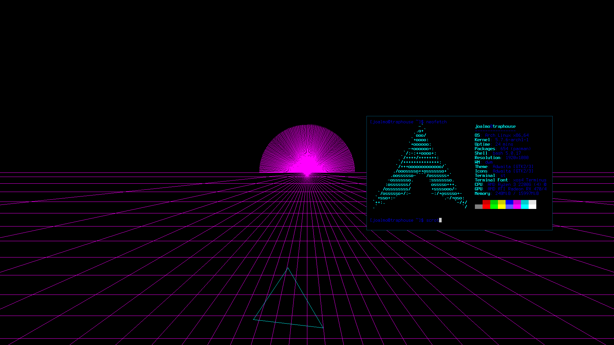

# xwow
xwow is a lightweight program for X11 that draws dynamic and interactive desktop backgrounds.

This program is intended for use with simple/non-bloat window managers, such as dwm. It may not work correctly in full desktop environments such as KDE or GNOME, as these draw layers over the root window, rendering it invisible.

[Demo on YouTube](https://www.youtube.com/watch?v=HlG9TPtvXyo)

## Building
Library requirements: `Xlib, SDL2`

1. Clone this repository, and cd into it.
2. See the "USER CONFIG" section of `xwow.h` and decide whether you'd like to tweak anything.
3. `$ sudo make install`.
4. xwow will be installed on your system.

## Running
`$ xwow` will begin drawing a random background.

`$ xwow [id]` will draw a specific background, where `id` is an ID from the list below.

You can add `xwow &` or `xwow [id] &` to your `~/.xinitrc` to automatically start drawing backgrounds when X starts.

## Contributing
If you would like to add a background to xwow, consider the following workflow. Feel free to reach out if you have questions.

Assume you're creating a background named `<name>`.

1. Create `bg/bg_<name>.h` and `bg/bg_<name>.c`. These files are where you'll write your rendering code.
2. Create a rendering function in `bg/bg_<name>.c` which accepts an SDL2 `SDL_Renderer*` as an argument and draws to this renderer. See other modules in the `bg/` directory to get you started. You can almost consider some of the simpler ones to be like templates.
3. Add `#include "bg/bg_<name>.h"` to the end of the list of includes in `xwow.h`.
4. Add a pointer to your rendering function to the end of the `BG_RENDER_FUNCS[]` array. E.g. `&bg_<name>_draw`.
5. Add `bg/bg_<name>.o` to the BLD list at the top of the Makefile.
6. Done! Feel free to open a PR.

The render function you created will be called once per frame as long as your background is running.

## Background ID List
The following is a list of IDs and descriptions for all of the backgrounds in xwow, to be used in `$ xwow [id]`.

ID | Description
---|------------
0 | `bg_corners` - lines from corners to cursor
1 | `bg_fade` - slow fading colors
2 | `bg_cyber` - synthwave-style low-poly sunset
3 | `bg_square` - square that bounces around the screen and changes colors
4 | `bg_party` - party mode
